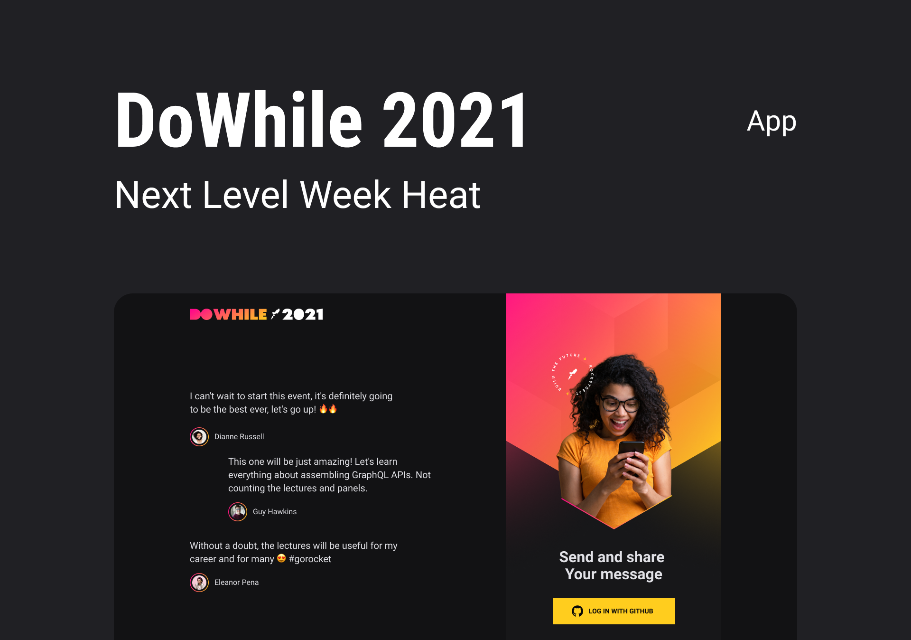

<h1 align="center">🚀 NLW7-Heat-Impulse 🚀</h1>

## 💻 About the project

Project developed during NLW (Next Level Week) on the Impulse track, where this week an application was built from scratch backend, frontend and mobile, an intense week full of content, but it was a great learning experience, as I learned a lot about how to integrate all areas that were still having a bit of difficulty at this point, an incredible experience, very cool, each day one more day of learning, looking forward to the next. 🚀🚀🚀

### Web:

  

### Mobile:

  

## 🧪 Technologies

The following tools were used in the construction of the project:

#### Back end

- [TypeScript](https://www.typescriptlang.org/)
- [Express](https://expressjs.com/en/starter/installing.html)
- [Prisma](https://www.prisma.io/docs/)
- [Axios](https://axios-http.com/docs/intro)
- [Cors](https://socket.io/docs/v3/handling-cors/)
- [Dotenv](https://openbase.com/js/dotenv/)
- [jsonwebtoken](https://jwt.io/libraries)
- [Socket.io](https://socket.io/docs/v4/)

#### Front end

- [TypeScript](https://www.typescriptlang.org/docs/handbook/utility-types.html)
- [ReactJS](https://reactjs.org/docs/getting-started.html)
- [Vite](https://vitejs.dev/)
- [Axios](https://axios-http.com/docs/intro)
- [React Icons](https://react-icons.github.io/react-icons/)
- [React Toastify](https://fkhadra.github.io/react-toastify/introduction)
- [Sass](https://sass-lang.com/documentation)
- [Socket.io](https://socket.io/docs/v4/client-api/)

#### Mobile

- [TypeScript](https://www.typescriptlang.org/docs/handbook/utility-types.html)
- [React Native](https://reactnative.dev/docs/getting-started)
- [Expo](https://docs.expo.dev/)
- [Expo App Loading](https://docs.expo.dev/versions/latest/sdk/app-loading/)
- [Expo Auth Session](https://docs.expo.dev/versions/latest/sdk/auth-session/)
- [Expo Font](https://docs.expo.dev/versions/latest/sdk/font/)
- [Expo Linear gradient](https://docs.expo.dev/versions/latest/sdk/linear-gradient/)
- [Axios](https://axios-http.com/docs/intro)
- [Async Storage](https://reactnative.dev/docs/asyncstorage)
- [Moti](https://moti.fyi/)
- [Socket.io](https://socket.io/docs/v4/client-api/)
- [React Native Iphone X Helper](https://www.npmjs.com/package/react-native-iphone-x-helper)
- [React Native Reanimated](https://docs.expo.dev/versions/latest/sdk/reanimated/)
- [React Native SVG](https://docs.expo.dev/versions/latest/sdk/svg/)

## ✅ Getting started

Before you begin, you will need to have the following tools installed on your machine:

- [Git](https://git-scm.com/)
- [Node.js](https://nodejs.org/en/)
- [Yarn](https://yarnpkg.com/) (optional)
- [Expo](https://expo.dev/).
- Also it's nice to have an editor to work with the code like [VSCode](https://code.visualstudio.com/).

> Note: to create the keys on github go to the link - https://github.com/settings/developers

- To work both web and mobile it is necessary to leave the backend running.
- We need to create an `.env` in the folder **backend** and put the following environment variables `GITHUB_CLIENT_SECRET` and `GITHUB_CLIENT_ID` both generated by github and `JWT_SECRET`, MD5 hash, a random key.
- To run on the Web when creating keys on github at `Homepage URL` put (http://localhost:4000) and at `Authorization callback URL` put (http://localhost:3000)
- To run on mobile when creating keys in github at `Homepage URL` and `Authorization callback URL` put the following url (https://auth.expo.io/@EXPO-USERNAME/APP-NAME) eg: https://auth.expo.io/@testeExpo/mobile

## 🎨 Layouts

See the layout in the link below (inspiration for the web layout):

- [Layout](https://www.figma.com/community/file/1031699316177416916)

You need an account on [Figma](http://figma.com/) to login.

---

made with 💜 by sestevao

